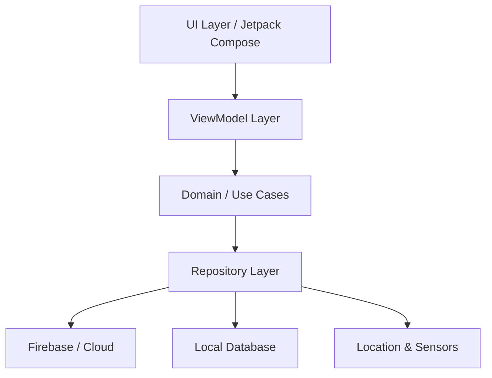

# NestCheck - Parental Monitoring & Child Control App

**Team**: Dev Raj Murari, Rohit, Sinan

## Tech Stack
- Kotlin
- Jetpack Compose
- MVVM & Clean Architecture
- Hilt (Dependency Injection)
- Firebase (Auth, Firestore, Realtime DB, Cloud Messaging)
- Google Maps SDK & Location Services
- TensorFlow Lite
- Room Database

## Features
1. Parent & Kid modes
2. Screen Time Monitoring
3. App Blocking & Limits
4. Real-time Location Tracking
5. Geofencing (Home/School)
6. Content Filtering (NSFW Detection)
7. Step Counter & Health Goals
8. Credit System for Rewards
9. SOS Alerts
10. Device Status Monitoring
11. Homework Tasks tracker
12. Activity Reports
13. Daily Goal Setting
14. Real-time Notifications
15. Profile Management
16. App Install Requests
17. Customizable Dashboard
18. Streak Tracking
19. Minimalist B&W UI
20. Secure Data Sync

## Architecture

## Setup Instructions
1. Clone the repository
2. Add your `google-services.json` to the `app/` folder
3. Build and run using Android Studio Hedgehog or later

## Screenshots
*(Coming soon)*

## License
MIT License
