# NestCheck - Autonomous Parental Monitoring & Child Protection


**NestCheck** is a modern, cyber-minimalist Android parental telemetry and child wellbeing monitoring platform built with Jetpack Compose, Kotlin Coroutines, and MVVM Clean Architecture.

**Team**: Dev Raj Murari, Rohit, Sinan

---

## 📱 App Screenshots

### Onboarding, Auth & Registration
| Login | Role Selection | Parent Register (Gmail OTP) | Child Register (Metrics & BMI) |
| :---: | :---: | :---: | :---: |
| 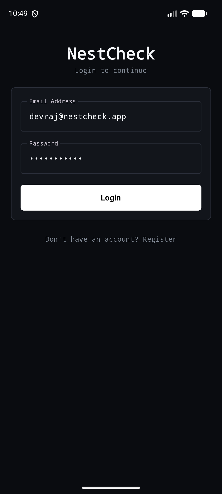 | 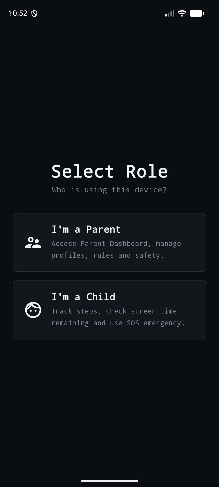 | 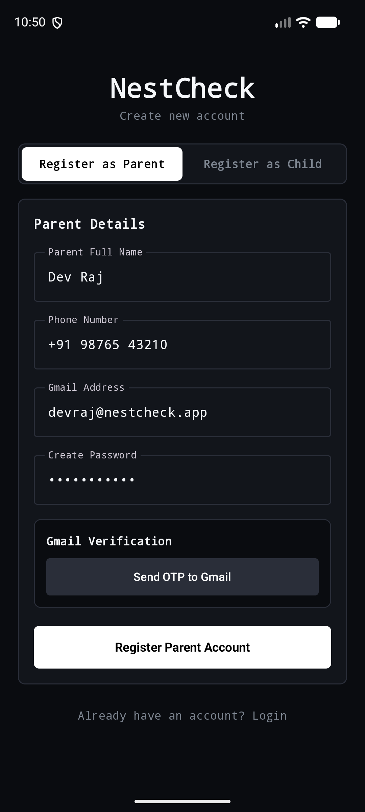 | 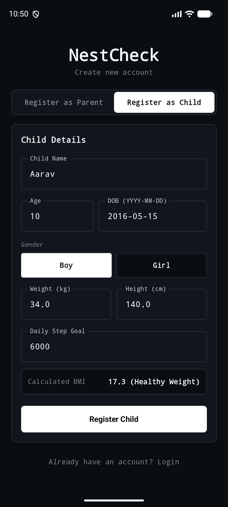 |

### Dashboards & Child Device
| Parent Dashboard | Child Home Screen | Reference Design |
| :---: | :---: | :---: |
| 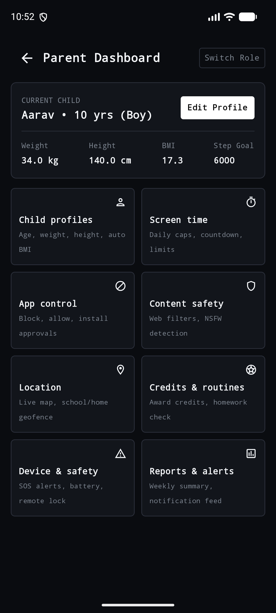 | 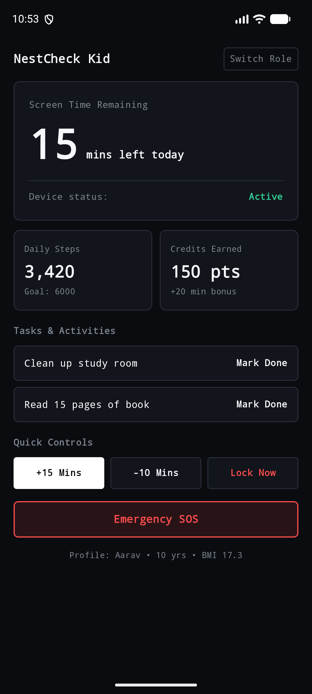 | 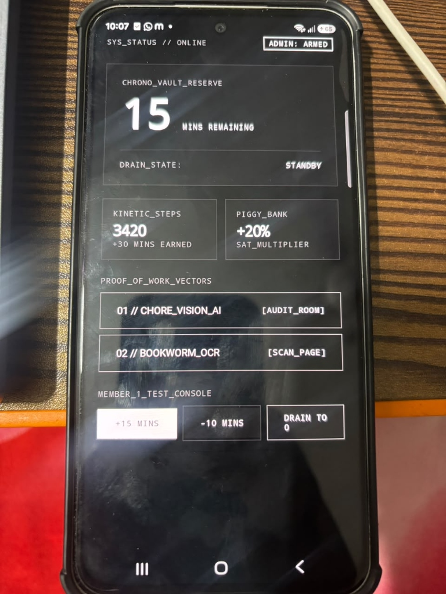 |

---

## 📐 Architecture & System Flows

### 1. System Architecture Overview
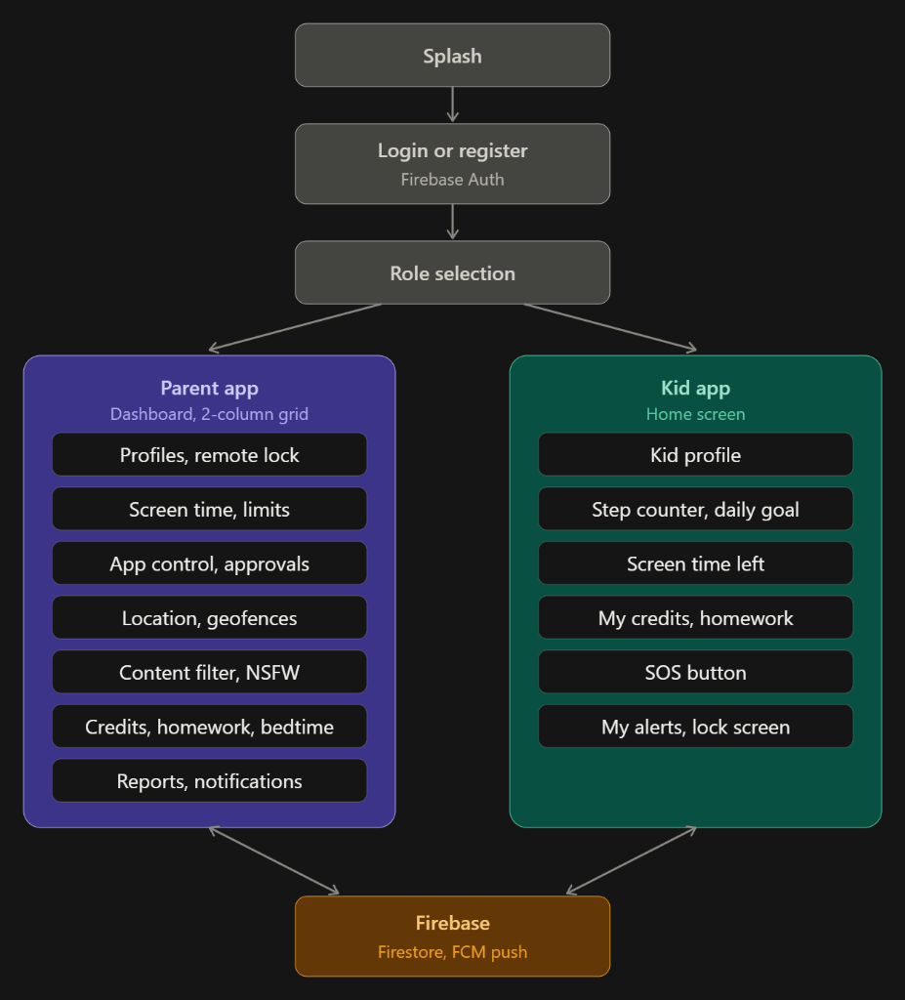

### 2. Onboarding & Device Pairing Flow
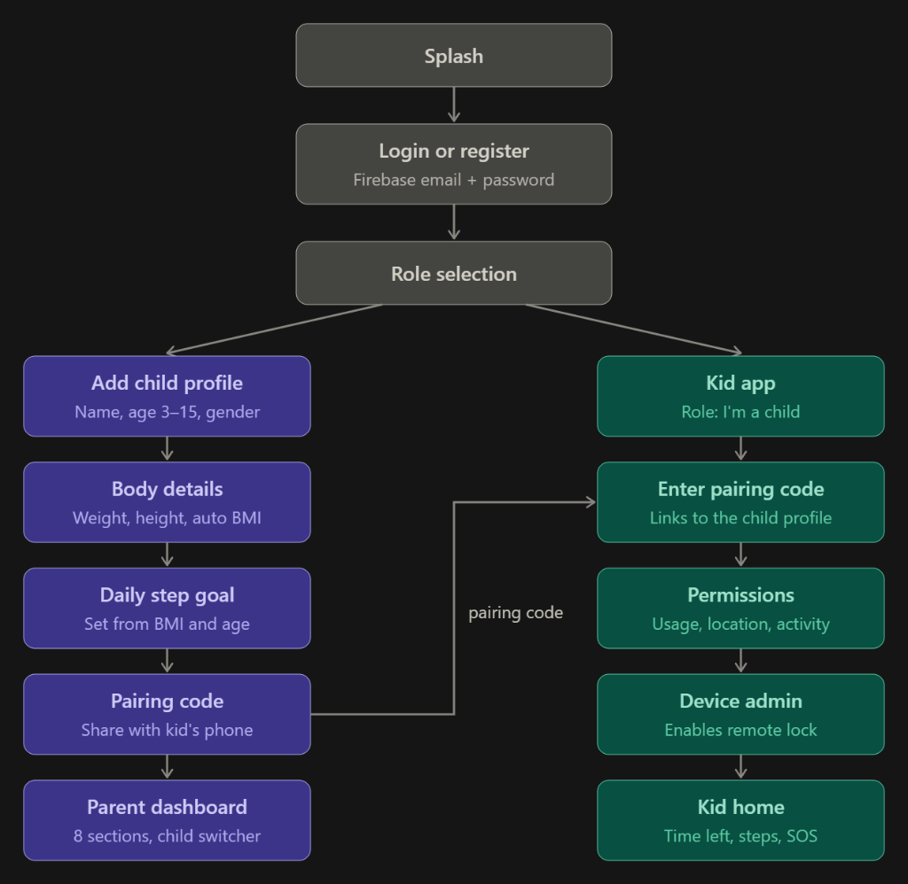

### 3. Parent Dashboard Layout
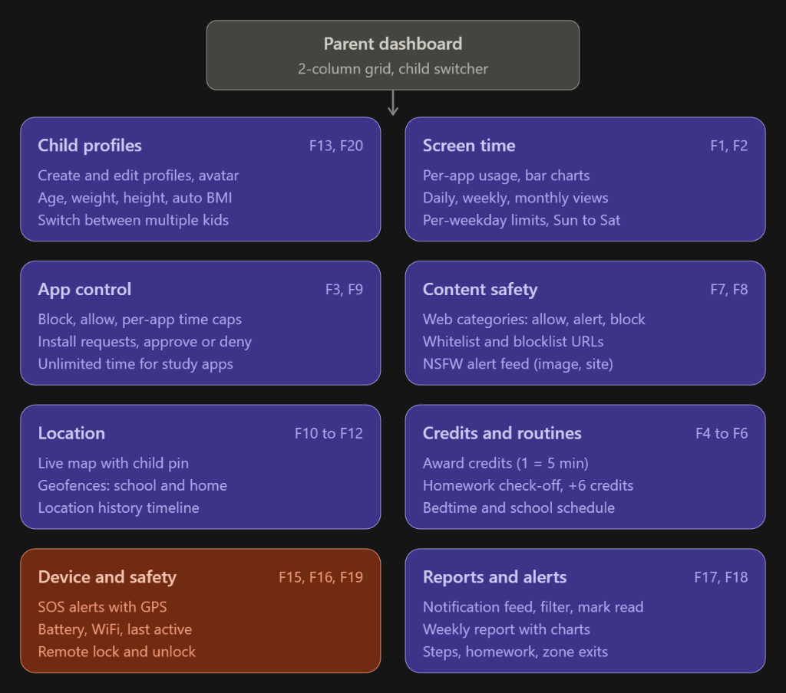

### 4. Child App Layout & Telemetry
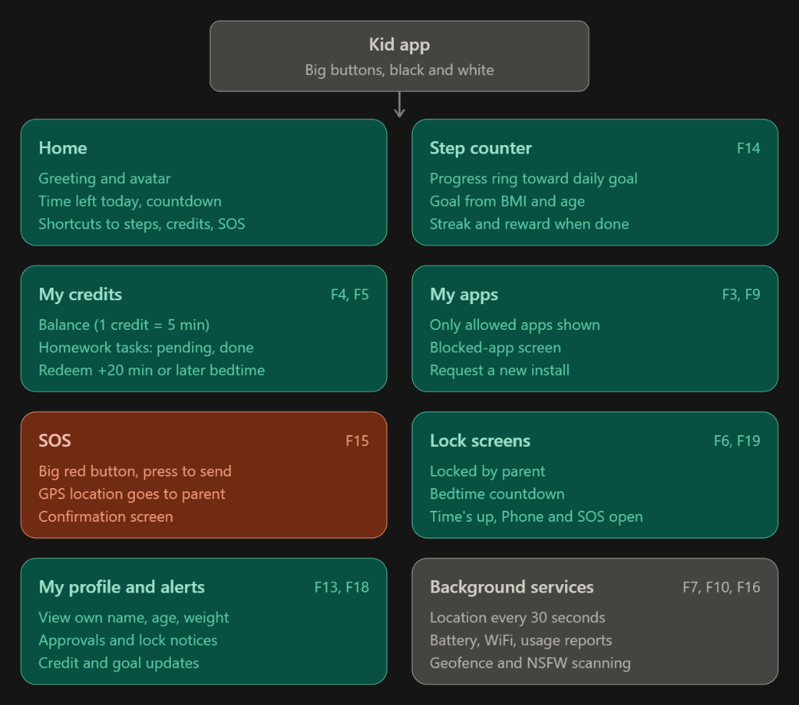

### 5. Cross-Device Real-Time Synchronization
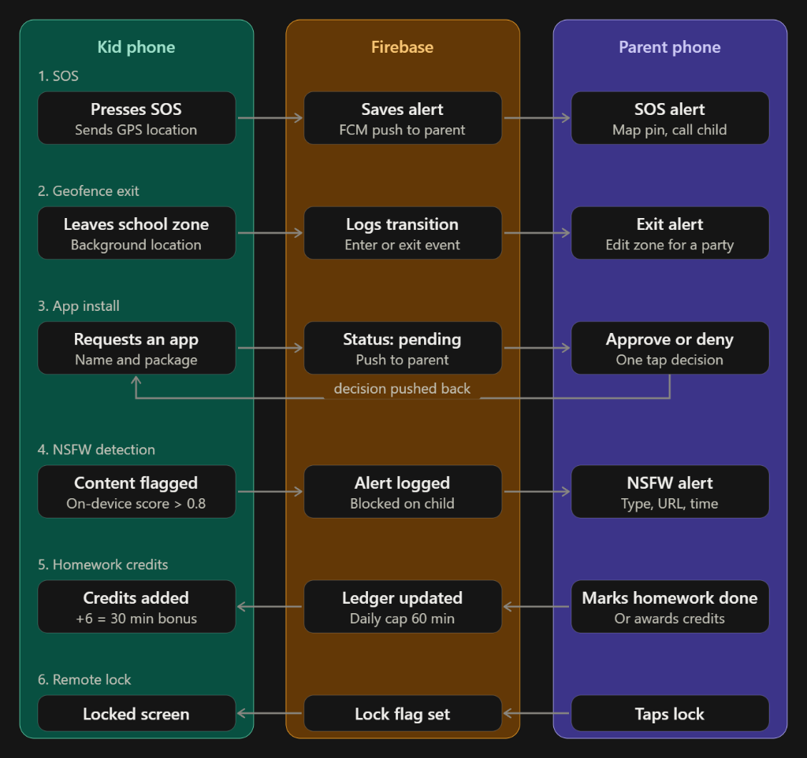

---

## 🛠️ Tech Stack
- **Language**: Kotlin 2.1.20
- **UI Toolkit**: Jetpack Compose (Material3 Dark Cyber-Minimalist Theme)
- **Architecture**: MVVM + Clean Architecture + Repository Pattern
- **Dependency Injection**: Hilt (Dagger)
- **Local Storage**: Room DB + DataStore
- **Cloud & Auth**: Firebase Auth, Firestore, FCM (with local offline fallback)
- **Machine Learning**: TensorFlow Lite for On-Device Content Safety
- **Sensors & Location**: Google Play Services Location & Hardware Step Detector

---

## 🚀 Setup & Build Instructions
1. Clone the repository:
   ```bash
   git clone https://github.com/dev-raj-murari/NestCheck.git
   cd NestCheck
   ```
2. Build the debug APK:
   ```bash
   ./gradlew assembleDebug
   ```
3. Run on connected Android device or emulator:
   ```bash
   adb install -r app/build/outputs/apk/debug/app-debug.apk
   adb shell am start -n com.nestcheck.app/.MainActivity
   ```

---

## 📄 License
MIT License
